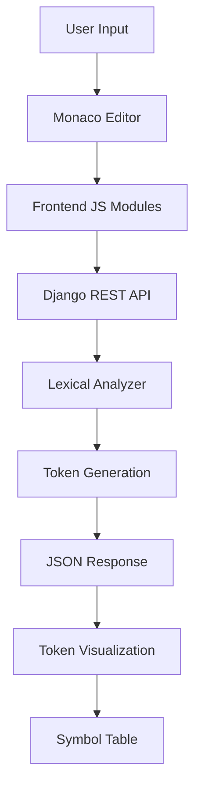

# 🛠️ Compilify - Tech Stack & Architecture

<div align="center">


**Educational Lexical Analysis Tool**

[](https://python.org)
[](https://djangoproject.com)
[](https://developer.mozilla.org/en-US/docs/Web/JavaScript)
[](https://docker.com)

</div>

---

## 🎯 **Project Overview**

**Compilify** is a modern, interactive web application designed for educational purposes to visualize lexical analysis and tokenization of mathematical expressions and basic programming constructs. Built with cutting-edge web technologies and compiler theory principles.

---

## 🏗️ **Architecture Overview**



---

## 🔧 **Backend Technologies**

### **🐍 Core Framework**
- **Django 4.2.7** - High-level Python web framework
  - Rapid development with "batteries included"
  - Built-in admin interface and ORM
  - Robust security features
  
- **Django REST Framework 3.14.0** - Powerful API toolkit
  - Serialization and deserialization
  - Authentication and permissions
  - Browsable API interface

### **⚡ Core Libraries**
- **Python 3.8+** with Type Hints
  - Modern Python features
  - Enhanced IDE support
  - Better code documentation
  
- **Regular Expressions (re)** - Pattern matching engine
  - Token pattern recognition
  - Efficient string processing
  - Unicode support

### **🚀 Production Stack**
- **Gunicorn 21.2.0** - WSGI HTTP Server
  - Production-grade performance
  - Worker process management
  - Memory efficient

- **WhiteNoise 6.6.0** - Static file serving
  - CDN-ready static files
  - Compression support
  - Cache optimization

### **🔒 Security & Configuration**
- **django-cors-headers 4.3.1** - CORS handling
- **python-dotenv 1.0.0** - Environment management
- **CSRF Protection** - Built-in Django security
- **Input Sanitization** - HTML entity escaping

---

## 🎨 **Frontend Technologies**

### **💻 Core Technologies**
- **HTML5** - Semantic markup with modern standards
- **CSS3** - Advanced styling with custom properties
- **Vanilla JavaScript (ES6+)** - Modern JS without framework overhead
- **Monaco Editor** - VS Code-powered code editor

### **🎨 Styling & Design**
- **Tailwind CSS** - Utility-first CSS framework
  - Rapid UI development
  - Consistent design system
  - Mobile-first responsive design

### **🔤 Typography System**
- **Orbitron** - Futuristic font for COMPILIFY branding
- **Fira Code** - Programming font with ligatures
- **Inter** - Modern sans-serif for UI elements

### **✨ Animations & Effects**
- **GSAP (GreenSock)** - High-performance animations
  - Hardware acceleration
  - Timeline-based animations
  - Cross-browser compatibility

---

## 📊 **Lexical Analysis Engine**

### **🔍 Token Recognition**
```
Supported Token Types:
├── Keywords: int, float, char, if, else, while, for
├── Operators: +, -, *, /, =
├── Identifiers: Variable names (a-z, A-Z, _, 0-9)
├── Numbers: Integers and floating-point
├── Punctuation: (, ), ;
└── Delimiters: Statement terminators
```

### **⚙️ Processing Pipeline**
1. **Input Sanitization** - HTML entity decoding
2. **Pattern Matching** - Regex-based tokenization
3. **Token Classification** - Category assignment
4. **Position Tracking** - Error location reporting
5. **Symbol Table Generation** - Identifier tracking

---

## 🏛️ **Design Patterns & Architecture**

### **Backend Patterns**
- **MVC Architecture** - Model-View-Controller separation
- **RESTful API Design** - Clean, predictable endpoints
- **Modular Structure** - Separated concerns
- **Error Handling** - Comprehensive exception management

### **Frontend Patterns**
- **Module Pattern** - Organized JavaScript modules
- **Component-Based Design** - Reusable UI components
- **Event-Driven Architecture** - Real-time interactions
- **Separation of Concerns** - Logic, presentation, data

### **Code Organization**
```
Compilify/
├── Backend/
│   ├── lexer.py          # Tokenization engine
│   ├── views.py          # API endpoints
│   └── urls.py           # URL routing
├── Frontend/
│   ├── editor-manager.js # Monaco editor handling
│   ├── lexical-analyzer.js # Token visualization
│   ├── ui-manager.js     # UI state management
│   └── compiler.js       # Main coordinator
└── Deployment/
    ├── Dockerfile        # Container configuration
    ├── docker-compose.yml # Multi-service setup
    └── nginx.conf        # Reverse proxy config
```

---

## 🚀 **Deployment & DevOps**

### **🐳 Containerization**
- **Docker** - Containerized deployment
  - Consistent environments
  - Easy scaling
  - Isolated dependencies

- **Docker Compose** - Multi-service orchestration
  - Web application container
  - Nginx reverse proxy
  - Volume management

### **☁️ Cloud Deployment**
- **Heroku Ready** - One-click deployment
  - Procfile configuration
  - Runtime specification
  - Environment variables

- **Generic Cloud Support**
  - AWS, GCP, Azure compatible
  - Environment-based configuration
  - Static file optimization

### **🔧 Development Tools**
- **Git** - Version control with semantic commits
- **Environment Management** - .env configuration
- **Hot Reload** - Development server auto-refresh

---

## 📈 **Performance Optimizations**

### **Frontend Performance**
- **Lazy Loading** - On-demand resource loading
- **Animation Optimization** - Hardware-accelerated transitions
- **Efficient DOM Manipulation** - Minimal reflows
- **Resource Compression** - Minified assets

### **Backend Performance**
- **Single-Pass Tokenization** - Efficient lexical analysis
- **Memory Management** - Proper object lifecycle
- **Static File Caching** - CDN-ready assets
- **Database Optimization** - Minimal queries

---

## 🔒 **Security Features**

### **Input Security**
- **XSS Prevention** - HTML entity escaping
- **Input Validation** - Malformed input handling
- **CSRF Protection** - Cross-site request forgery prevention
- **CORS Configuration** - Controlled cross-origin access

### **Production Security**
- **Environment Variables** - Sensitive data protection
- **Debug Mode Control** - Production-safe configuration
- **Security Headers** - HTTP security headers
- **Static File Security** - Secure asset serving

---

## 📱 **Browser Compatibility**

### **Supported Browsers**
| Browser | Version | Support Level |
|---------|---------|---------------|
| Chrome  | 80+     | ✅ Full       |
| Firefox | 75+     | ✅ Full       |
| Safari  | 13+     | ✅ Full       |
| Edge    | 80+     | ✅ Full       |

### **Progressive Enhancement**
- **Core Functionality** - Works without JavaScript
- **Enhanced Experience** - Rich interactions with JS enabled
- **Responsive Design** - Mobile and desktop optimized
- **Accessibility** - Screen reader compatible

---

## 🎓 **Educational Focus**

### **Learning Objectives**
- **Compiler Theory** - Lexical analysis fundamentals
- **Pattern Recognition** - Regular expression understanding
- **Token Classification** - Programming language structure
- **Interactive Learning** - Visual feedback and exploration

### **Target Audience**
- **Computer Science Students** - Academic learning support
- **Programming Educators** - Teaching tool for concepts
- **Self-Learners** - Independent study resource
- **Developers** - Understanding compilation process

---

## 📊 **API Documentation**

### **Lexical Analysis Endpoint**
```http
POST /api/lexical/
Content-Type: application/json

{
    "code": "x + 5 * (y - 2);"
}
```

**Response:**
```json
{
    "success": true,
    "tokens": [
        {"type": "IDENTIFIER", "value": "x", "position": 0},
        {"type": "PLUS", "value": "+", "position": 2},
        {"type": "NUMBER", "value": "5", "position": 4},
        {"type": "MULTIPLY", "value": "*", "position": 6},
        {"type": "LPAREN", "value": "(", "position": 8},
        {"type": "IDENTIFIER", "value": "y", "position": 9},
        {"type": "MINUS", "value": "-", "position": 11},
        {"type": "NUMBER", "value": "2", "position": 13},
        {"type": "RPAREN", "value": ")", "position": 14},
        {"type": "SEMICOLON", "value": ";", "position": 15}
    ],
    "token_count": 10
}
```

---

## 🛠️ **Development Setup**

### **Quick Start**
```bash
# Clone repository
git clone https://github.com/nomancsediu/Compilify.git
cd Compilify

# Setup virtual environment
python -m venv venv
source venv/bin/activate  # On Windows: venv\Scripts\activate

# Install dependencies
pip install -r requirements.txt

# Run migrations
python manage.py migrate

# Start development server
python manage.py runserver
```

### **Docker Setup**
```bash
# Build and run with Docker Compose
docker-compose up --build

# Access application
open http://localhost:8000
```

---

## 📈 **Future Enhancements**

### **Planned Features**
- **Syntax Analysis** - Parse tree generation
- **Semantic Analysis** - Type checking and validation
- **Code Generation** - Assembly/bytecode output
- **Multiple Languages** - Support for different programming languages

### **Technical Improvements**
- **WebAssembly Integration** - Performance optimization
- **Real-time Collaboration** - Multi-user editing
- **Advanced Visualizations** - 3D token representations
- **Mobile App** - Native mobile applications

---

<div align="center">

**Built with ❤️ for Computer Science Education**

[🌟 Star on GitHub](https://github.com/nomancsediu/Compilify) • [🐛 Report Bug](https://github.com/nomancsediu/Compilify/issues) • [💡 Request Feature](https://github.com/nomancsediu/Compilify/issues)

</div>